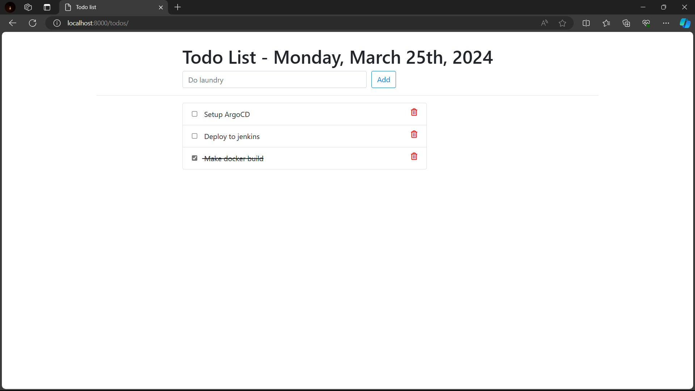

# TodoApp Deployment using Jenkins, ArgoCD, and Kubernetes

## Todo App
### Technology used :
- Python (3.9) - Programming language for the todo application
- Django - Python web framework 

## Deployment
