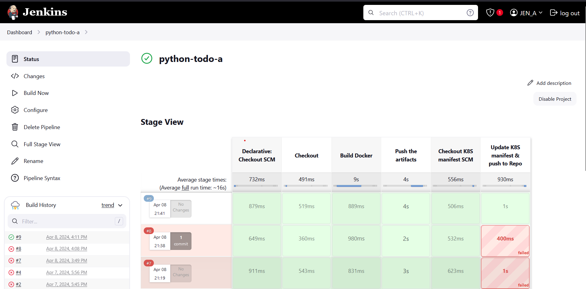

# TodoApp Deployment using Docker Jenkins, ArgoCD, and Kubernetes

## Todo App
This project is a simple Todo application written in Python, accompanied by a Continuous Integration/Continuous Deployment (CI/CD) pipeline using Docker, Jenkins, ArgoCD, and Kubernetes.

## Table of Contents

1. [Features](#features)
2. [Prerequisites](#prerequisites)
3. [Installation](#installation)
4. [Run](#run)
5. [CI/CD Pipeline](#cicd-pipeline)
6. [Contributing](#contributing)
7. [License](#license)

## Features
- Add, delete, update, and view todo tasks.
- Dockerized deployment for easy portability and scalability.
- CI/CD pipeline for automated testing and deployment.
- Integration with Jenkins for CI automation.
- Deployment automation through ArgoCD and Kubernetes.

## Prerequisites
### Ensure you have the following installed:

- Docker
- Jenkins
- ArgoCD
- Kubernetes (minikube or any Kubernetes cluster)

## Installation

1. Clone this repository:
```bash
    git clone https://github.com/ARUP-G/Python-todoApp-Jenkins-Argocd-K8s.git
```

2. Navigate to the project directory:
```bash
    cd Python-todoApp-Jenkins-Argocd-K8s
```
3. Build the Docker image:
```bash
    dokcer build -t todo-app:1 .
```
## Run
### Docker way
1. Run the Docker container:
```bash
    docker run -d -p 5000:5000 todo-app:1
```
2. Access the Todo app through your web browser at http://localhost:5000.


## CI/CD Pipeline
The CI/CD pipeline for this project is orchestrated using Jenkins, ArgoCD, and Kubernetes.
1. Continuous Integration (CI) with Jenkins:
    Upon pushing changes to the repository, Jenkins automatically triggers a build job. This job involves running unit tests and linting to ensure code quality.

    - Jenkins: 
        Build jenkins pipeline and build and run the pipeline.


        

2. **Continuous Deployment (CD) with ArgoCD and Kubernetes:** 
    Once the code passes CI, Jenkins triggers a deployment job. This job builds a Docker image and pushes it to a Docker registry. ArgoCD, configured to monitor the repository, detects changes and automatically deploys the updated Docker image to the Kubernetes cluster.

 - __Push to Docker Hub:__
        By executing the pipeline the image will be added to dockerhub registry.

_Note: Make sure to change `"Push the artifacts"` stage in jenkinsfile with proper credentials and registry username_.


- __ArgoCD:__ 
    Go into deployment manifest module and execute the command.

    ```sh
     kubectl apply -f service.yaml
    ```
    *For more information about the deployment manifest 
    visit _https://github.com/ARUP-G/Todo-app-deployment-manifest.git_


 **To access the app**
 - Minikube way


    ```bash
    minikube service todo-service
    ```
    then you will get the `url` to access the app.


## Contributing
Contributions are welcome! If you find any issues or have suggestions, please open an issue or submit a pull request.

## License
This project is licensed under the MIT License.